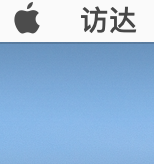

# 标题1
## 标题2

我的爱好是

* 唱
* 跳
* 飞行
* rap
  
我的电影是

1. 高远远
2. 古墓丽影

这里是代码

    var a = 1
    alert(a)

   ```javascript
var a =1
alert (a)
console.log('hello')
  ```
我的网站是 [我的官网](https://fangyinghang.com)




